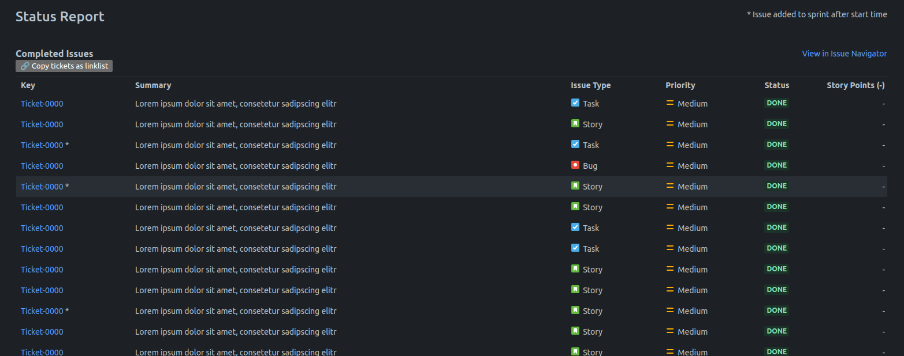

# Jira Enhanced

My slowly growing collection of small changes to the Jira UI.

## 🔗 Installation

As these updates are written as a userscript so [Tampermonkey](https://www.tampermonkey.net/)
or something similar (I have not testes this with any other extension yet) is needed as a framework.

For the latest version open `jiraEnhanced.user.js` as a
[raw file](https://github.com/muePatrick/jira-enhanced/raw/refs/heads/main/jiraEnhanced.user.js)
which should trigger the installation process of the extension.

Or go to [Releases](https://github.com/muePatrick/jira-enhanced/releases) and open the file
`jiraEnhanced.user.js` in the assets section of the desired release.

## ⚙️ Configuration

To change the configuration open the installed script through the extensions dashboard and update
the `config` object at the top of the script however you like.

## 🔩 Enhancements

### Unlock Dialog Width

Unlock the width of dialogs (e.g. ticket preview). Useful on widescreen monitors and tickets with
a lot of content.

### Add Copy Link List Button

Add a new button above the "Completed Issues" table in the "Status Report"
section of the "Sprint Report" page. When clicked the links to all the
completed tickets are copied to the clipboard as a link list which can
be pasted into Confluence pages, etc. (Confluence might need an unformatted
paste Ctrl-Shift-V, to not automatically format the linklist)

